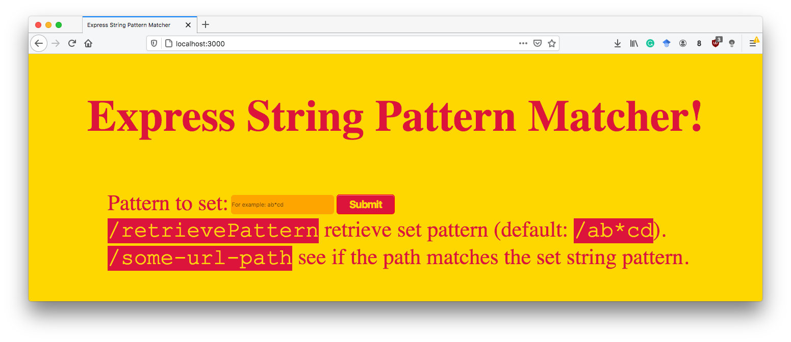

# Demo code <!-- omit in toc -->

Each of the directories `node-XX-ex` contain a fully working toy example, showcasing a particular Node.js/Express concept. They are referred to and explained throughout the different web lectures. For each one, installation and usage instructions are provided.

Execute the following command in the terminal to download all source code examples (as well as all lecture materials) at once:

```console
git clone https://github.com/chauff/demo-code.git
```

**The following instructions to install and run the different scripts assume you are currently in the directory where the above line was executed.**

- [firefox-extension](#firefox-extension)
- [node-file-watching-ex](#node-file-watching-ex)
- [node-tcp-ex](#node-tcp-ex)
- [node-web-ex](#node-web-ex)
- [node-express-ex](#node-express-ex)
- [node-express-regex](#node-express-regex)
- [node-websocket-ex](#node-websocket-ex)
- [node-ajax-ex](#node-ajax-ex)
- [node-component-ex](#node-component-ex)
- [node-sessions-ex](#node-sessions-ex)
- [node-cookies-ex](#node-cookies-ex)
- [node-ejs-ex](#node-ejs-ex)
- [node-SPAs-ex](#node-spas-ex)


## firefox-extension

This extension overlays a `<div>` on every page (once it is enabled of course) on the left-hand side of the web page. It lists the cookie name/value pairs that are accessible to it through JavaScript.

To enable it on Firefox, execute the following steps:

1. Type `about:debugging` into your browser's address bar.
2. Click the `This Firefox` icon on the top-left.
3. Click the `Load Temporary Add-on` button and navigate to the `manifest.json` file.

You are done, the extension is now available.

Navigate to any page of your choice and you should see the cookie information on the left. To disable the extension, simply click the `Remove` button on the `This Firefox` panel for this extension.

## node-file-watching-ex

This Node.js script *watches* a file and reports on the console, when a change occurred.

To run it, execute the following commands in your terminal:

```console
cd Web-Teaching/demo-code/node-file-watching-ex/
node watching.js todos.txt
```

If you now change the file `todos.txt` (which resides in the same folder as `watching.js`) in your favorite editor, you will see a `File changed!` message appear in the terminal.

## node-tcp-ex

This Node.js script (=server) watches a file and informs subscribed clients about file changes.

To run it, execute the following commands in your terminal:

```console
cd Web-Teaching/demo-code/node-tcp-ex/
node tcp.js todos.txt 3000
```

Of course you can change the port number at will (we use 3000 for all our examples). If everything runs as intended, you will see a `Listening to subscribers...` message.

Now open **another** terminal window (*while keeping the first one open*) and use `telnet` to subscribe **as a client** with the following command:

```console
telnet localhost 3000
```

If everything went as intended, your client now shows the message `Now watching todos.txt for changes` and your server shows `Subscriber connected`. Alter the `todos.txt` file and then disconnect the client and observe the message(s) that appear.

## node-web-ex

This Node.js script shows the most minimalistic web server possible: whatever the HTTP request, it will respond with `Hello World!`. To start it, execute the following command in your terminal:

```console
cd Web-Teaching/demo-code/node-web-ex/
node web.js 3000
```

Open your browser and use the following URL `http://localhost:3000/` to receive the server's `Hello World!` message.

## node-express-ex

This Node.js script makes use of the Express framework. It is a simple web server that has a route `/greetme` and sends a simple text message in the HTTP response. As Express is not a module installed by default, we first have to install the required modules as stated in `package.json`:

```console
cd Web-Teaching/demo-code/node-express-ex/
npm install
node web.js
```

Here, we actually do not provide a port number, as port `3000` is hard-coded into `web.js`. Now open your browser and try different URLs:

- http://localhost:3000/
- http://localhost:3000/greetme
- http://localhost:3000/greetme?name=Claudia
- http://localhost:3000/greetme?firstname=Claudia
- http://localhost:3000/greetme?location=Delft&name=Claudia
- http://localhost:3001/

## node-express-regex



This is a demo of an **Express string pattern matcher**. It allows you to set a string pattern via an HTML form and then trial different URLs to see whether they match the submitted pattern. By default, pattern `/ab*cd` is set. 

Note, that the pattern is set **without** a leading dash `/`, so the route `/ab*cd` is set by submitting the string pattern `ab*cd`. There is no input validation taking place, it is up to you to submit a valid string pattern.

Install the demo as follows:

```console
cd Web-Teaching/demo-code/node-express-regex-ex/
npm install
node web.js
```

Now start the browser and access `http://localhost:3000/`. A call to `http://localhost:3000/retrievePattern` shows the currently set pattern. To check the result of submitting valid and invalid routes, try the following two URLS:

- `http://localhost:3000/ab` (invalid)
- `http://localhost:3000/ab1234cd` (valid)

Now that you know how the demo works, submit your own string pattern via the form and test your string pattern knowledge!

## node-websocket-ex

This Node.js script makes use of the Express framework. It is a simple web server that has a route `/greetme` and sends a simple text message in the HTTP response. As Express is not a module installed by default, we first have to install the required modules as stated in `package.json` and then, the server can be started:

```console
cd Web-Teaching/demo-code/node-websocket-ex/
npm install
node app.js 3000
```

Now open your browser and access the following URL: http://localhost:3000/. The client initiates the WebSocket connection with the server and receives a corresponding response. You can see this happening clearly when opening the Network Monitor of the browser's web development tools.

*Note: in `package.json` we have defined a `start` script this time, we could have also started the application with `npm start` instead of `node app.js 3000`. Both options are valid and result in the same behavior.*

## node-ajax-ex

This Node.js script showcases the use of Ajax in the form of a toy todo application. The server has todo items stored in memory that can be retrieved by the client (`/todos`); the client can also send additional todo items to the server (`/addtodo`). Install and start the server as follows:

```console
cd Web-Teaching/demo-code/node-ajax-ex/
npm install
node app.js
```

Now open your browser and access the following URL: http://localhost:3000/. You will see a list of todos (retrieved through an Ajax request).

*Note: as in the previous example, we have defined a `start` script, so `node app.js` could have been replaced by `npm start`.*

## node-component-ex

Install and run the server (which sends todos to the client when the client requests them with the correct username/password combination):

```console
cd Web-Teaching/demo-code/node-component-ex/
npm install
npm start
```

Now open another terminal and use `curl`:

- Request the list of wishes without authorization, i.e. `curl http://localhost:3000/wishlist` - you should see an `Unauthorized access` error.
- Request the list of wishes with the correct username and password (as hard-coded in our demonstration code): `curl --user user:password http://localhost:3000/wishlist`. The option `--user` allows us to specify the username and password to use for authentication in the `[USER]:[PASSWORD]` format. This request should work and you should receive the list of todos.
- Request the list of todos with an incorrect username/password combination: `curl --user test:test http://localhost:3000/wishlist`. You should receive a `Wrong username/password combination` error.
- Add a wish to the wishlist: `curl --user user:password 'http://localhost:3000/addWish?type=board%20game&name=Treasure%20Hunt&priority=low'` (note that whitespaces are replaced by `%20` in URLs and the URL has to appear within quotes due to the special characters `&` in it).

## node-sessions-ex

In this toy example, we count how often a user access a route (`/countme`) in a session. Install and start the server as follows:

```console
cd Web-Teaching/demo-code/node-sessions-ex/
npm install
node app.js
```

Now open your browser and access the following URL: http://localhost:3001/. Refresh the page a few times and then restart the browser or use a private browser window to start another session (just opening a new browser tab or window will not result in another session).

## node-cookies-ex

In this toy example, we count how often a user access a route (`/countme`) in a session. Install and start the server as follows:

```console
cd Web-Teaching/demo-code/node-cookies-ex/
npm install
node app.js 3000
```

Now open your browser and access the following URLs:
- http://localhost:3000/sendMeCookies
- http://localhost:3000/listAllcookies

In order to see the cookies the browser receives, open the Network Monitor of the web development tools.

## node-ejs-ex

In this toy example, we use the view engine to send HTML templates with data in response to HTTP requests. Install and start the server:

```console
cd Web-Teaching/demo-code/node-ejs-ex/
npm install
node app.js 3000
```

Now open your browser and access the following URL: http://localhost:3000/todos.

## node-SPAs-ex

This folder contains a number of single-page applications that are used mostly in exams. Install and start the server

```console
cd Web-Teaching/demo-code/node-ejs-ex/
npm install
node app.js 3000
```

Available are now three applications:
- http://localhost:3000 shows off a digital clock (where the digits are designed with CSS `border-X` properties) that receives time updates from the server via Ajax.
- http://localhost:3000/keypress shows off a utility app: whenever a key on the keyboard is pressed, the page shows the event code of that key. Contains a bit of EJS.
- http://localhost:3000/colors/pink/blue shows off another utility app: the URL takes two colors (which it assumes exist in CSS's color space) and render a Hello World! text; the background color is the first color of the URL and the font color is the second color. It can be seen as a simple way to check whether two colors harmonize well with each other.